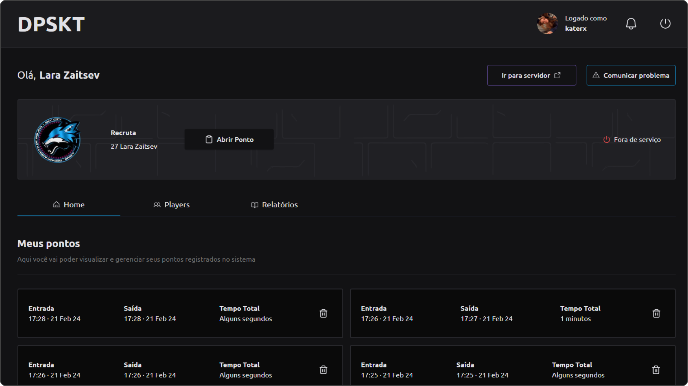

<p align="center">
   
</p>

<br />

<p align="center">	
  
  

  <a href="https://github.com/bkkater/dpskt-web/commits/master">
    
  </a> 
  
  
</p>

<br />
<br />

<p>

   
  <a href="https://dpskt.vercel.app/" target="_blank">
    
  </a>
</p>

# :pushpin: Tabela de Conteúdo

* [Propósito do projeto](#closed_book-propósito-do-projeto)
* [Tecnologias](#computer-tecnologias)
* [Funcionalidades](#rocket-funcionalidades)
* [Repositórios](#computer-repositórios)
* [Como rodar](#construction_worker-como-rodar)

# :closed_book: Propósito do projeto

O objetivo ao criar este projeto foi desenvolver conhecimentos e estudar as mudanças nas tecnologias Next 13, Tanstack Table V8 e explorar algumas utilidades do Tailwind CSS. Este projeto será contínuo e servirá como um Proof of Concept (PoC) para experimentar e testar novas bibliotecas de acordo com o aprendizado adquirido. 

Também me desafiei a desenvolver o backend em Node.js e MongoDB, buscando aprofundar meu conhecimento nessas tecnologias e garantir uma integração eficiente com o frontend do projeto.

Para o futuro, planejo implementar testes e refatorar componentes para adotar o Composition Pattern, visando aprimorar a qualidade e a escalabilidade do projeto.


# :computer: Tecnologias

Esse projeto foi feito utilizando as seguintes tecnologias:
<details>
  <summary>Front-end</summary>

-   [React](https://pt-br.reactjs.org/)
-   [Next.js](https://nextjs.org/)
-   [Tailwind CSS](https://tailwindcss.com/)
-   [Next-Auth](https://next-auth.js.org/)
-   [React Hook Form](https://react-hook-form.com/)
-   [Axios](https://www.npmjs.com/package/axios)
-   [Date-fns](https://date-fns.org/)
-   [Yup](https://www.npmjs.com/package/yup)
-   [Ant Design (Antd)](https://ant.design/)

</details>

<details>
  <summary>Back-end</summary>

-   [Express](https://expressjs.com/)
-   [Mongoose](https://mongoosejs.com/)

</details>

<details>
  <summary>Discord Bot</summary>

-   [Discord.js](https://discord.js.org/)

</details>

# :rocket: Funcionalidades

- **Registro de Tempo de Patrulha**: Os policiais podem utilizar comandos específicos para iniciar e encerrar seu tempo de patrulha, registrando assim as horas trabalhadas.
- **Relatórios**: Os policiais com cargos administrativos podem gerar relatórios com os registros de tempo de patrulha dos policiais, facilitando sua análise e gestão.
- **Gestão de Pessoal**: Os policiais com cargos administrativos têm acesso a comandos para gerenciar os policiais, como promoção, rebaixamento e exoneração.

# :computer: Repositórios
-   [WEB](https://github.com/bkkater/dpskt-web)
-   [API](https://github.com/bkkater/dpskt-api)
-   [BOT](https://github.com/bkkater/dpskt-bot)

# :construction_worker: Como rodar
```bash
# Clone o Repositório
$ git clone https://github.com/bkkater/dpskt-web.git
```

### 📱 Run Project

```bash
# Vá para a pasta dpskt-web
$ cd dpskt-web
# Instale as depedencias
$ npm install
# Rode a aplicação
$ npm run dev
```

# :closed_book: LICENSE

Esse projeto está sobre [MIT license](./LICENSE).


